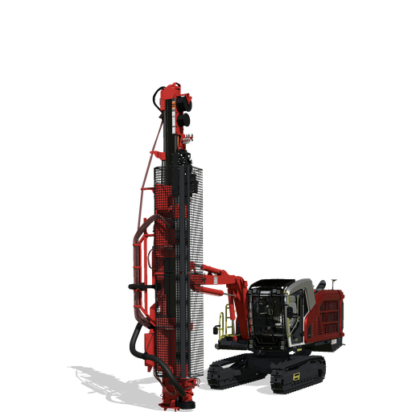

# Sandvik DX800i – Raupenbohrgerät für den Landwirtschafts-Simulator 2025

Der **Sandvik DX800i** ist ein leistungsstarkes Bohrgerät für den Einsatz im Steinbruch, Tunnel- und Tiefbau. Mit diesem Mod erhältst du ein präzise animiertes Gerät für realistische Bohrsimulationen im LS25 – ideal in Verbindung mit Quarry- oder Mining-Maps.

---

## 🧨 Features

- 🔩 Komplett animierter Bohrarm mit mehreren Gelenken
- 🔄 360° drehbare Kabine
- 🦿 Ausklappbare Stützfüße mit Hydraulik
- 🎮 Joystick-gesteuerte Bohr- und Schwenkfunktionen
- 🔊 Eigene Motor- und Arbeitsgeräuschkulisse
- 💡 Arbeitslichter und Rundumleuchte
- 🧱 Bohranimation

---

## 📦 Technische Daten

| Eigenschaft             | Wert                          |
|-------------------------|-------------------------------|
| Leistung                | 210 kW / ~285 PS              |
| Eigengewicht            | ca. 22.000 kg                 |

## 🧱 Credits

- Modell, Texturen, XML & Scripts: **fmods**
- Danke an Came für testen meiner Mods
  
## 📜 Lizenz

Dieser Mod darf **nicht ohne Zustimmung weiterverbreitet oder verändert** hochgeladen werden.

## 📎 Hinweise

- Mod befindet sich aktuell in der finalen Testphase
- Für Feedback, Bugs oder Ideen bitte Kontakt über Discord: `fmods` oder über GitHub Issues

📥 [Mod herunterladen](https://mega.nz/file/jtJSTQ6J#kRPyN4DW6RmpSjowiKGJRMqvU938mJKUHfDs4g26HMY)

**Viel Spaß!**  
*– fmods*
